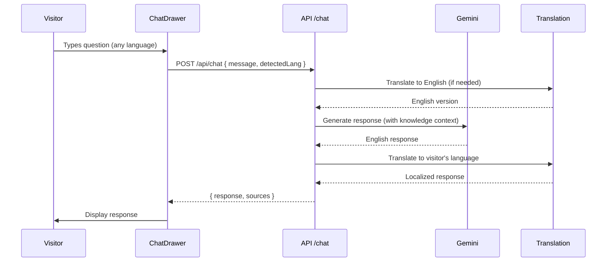

# AI Chatbot & Documents Collection Development Plan

> **Phase 25 COMPLETE ✅ | Phase 26 PLANNED 🎯**  
> Staff document tools complete + Visitor concierge needs admin configuration  
> **Last Updated:** February 1, 2026

---

## 📋 Phase Summary

| Phase | Feature | Status |
|-------|---------|--------|
| **Phase 25** | Documents Collection (Staff Tools) | ✅ **Complete** |
| **Phase 26** | AI Museum Concierge Configuration | 🎯 **Next Session** |

---

## ✅ PHASE 25: Documents Collection (COMPLETE)

### What's Implemented

| Feature | Status |
|---------|--------|
| DocumentCollectionWizard | ✅ 3-step upload wizard |
| Multi-format extraction | ✅ PDF, DOCX, DOC, RTF, ODT, PPTX |
| DocumentAIToolsPanel | ✅ Full-width with Single/Batch modes |
| AI Tools (Summarize/Facts/FAQ/Tags) | ✅ Working |
| Batch document selection | ✅ Checkbox UI |
| Auto-save persistence | ✅ Immediate DB save |

### Key Files

| Component | Path |
|-----------|------|
| Document Wizard | `app/src/components/collections/DocumentCollectionWizard.tsx` |
| AI Tools Panel | `app/src/components/collections/DocumentAIToolsPanel.tsx` |
| Documents API | `app/server/routes/documents.ts` |
| Gemini Analysis | `app/server/routes/gemini.ts` |

---

# 🎯 PHASE 26: AI MUSEUM CONCIERGE (NEXT SESSION)

> **Vision:** Give museums a powerful, intuitive interface to configure their AI concierge - importing document collections as knowledge, setting default questions, customizing behavior, and providing multilingual visitor assistance.

---

## 🏗️ Architecture Overview

```
┌─────────────────────────────────────────────────────────────────────────────────┐
│                         AI MUSEUM CONCIERGE SYSTEM                               │
├──────────────────────────────────────────┬──────────────────────────────────────┤
│    ADMIN CONFIGURATION (Staff)           │    VISITOR EXPERIENCE (Public)       │
│    ┌────────────────────────────────┐    │    ┌────────────────────────────┐    │
│    │  🎛️ Concierge Settings         │    │    │  💬 Chat Drawer             │    │
│    │  - Enable/Disable             │────│───▶│  - Slide-in from right     │    │
│    │  - Persona/Tone               │    │    │  - Quick action buttons    │    │
│    │  - Welcome message            │    │    │  - Message history         │    │
│    └────────────────────────────────┘    │    │  - Multilingual auto-detect│    │
│                   ↓                      │    └────────────────────────────┘    │
│    ┌────────────────────────────────┐    │                  ↑                   │
│    │  📚 Knowledge Sources          │    │    ┌────────────────────────────┐    │
│    │  - Import document collections │───│───▶│  🤖 Gemini RAG Engine       │    │
│    │  - Add tour content           │    │    │  - Context from knowledge   │    │
│    │  - Manual FAQ entries          │    │    │  - Grounded responses      │    │
│    │  - External URLs (scrape?)    │    │    │  - Magic Translation       │    │
│    └────────────────────────────────┘    │    └────────────────────────────┘    │
│                   ↓                      │                                      │
│    ┌────────────────────────────────┐    │                                      │
│    │  ❓ Quick Actions / Suggested  │    │                                      │
│    │  - Default question buttons    │────│────────────────────▶ Displayed to    │
│    │  - Categorized (Hours, Access) │    │                      visitors        │
│    │  - Drag-and-drop reorder      │    │                                      │
│    │  - Translate to all languages │    │                                      │
│    └────────────────────────────────┘    │                                      │
└──────────────────────────────────────────┴──────────────────────────────────────┘
```

---

## 📱 NEW VIEW: `/concierge` (Admin Configuration)

### Layout Design

```
┌─────────────────────────────────────────────────────────────────────────────────┐
│  🤖 AI Concierge Configuration                          [Preview] [Save]        │
├────────────────────────────────────┬────────────────────────────────────────────┤
│                                    │                                            │
│  SIDEBAR (Settings)                │  MAIN PANEL (Content Management)           │
│  ┌────────────────────────────┐    │  ┌────────────────────────────────────────┐│
│  │ 🔘 Status                  │    │  │  📚 Knowledge Sources              [+] ││
│  │    ○ Enabled   ● Disabled  │    │  │                                        ││
│  │                            │    │  │  ┌─────────────────────────────────┐   ││
│  │ 🎭 Persona                 │    │  │  │ 📁 Museum Policies Collection  ⋮│   ││
│  │    [Friendly Docent    ▾]  │    │  │  │    15 documents • 24,500 chars │   ││
│  │    ○ Friendly Docent       │    │  │  └─────────────────────────────────┘   ││
│  │    ○ Professional Guide    │    │  │  ┌─────────────────────────────────┐   ││
│  │    ○ Fun Family-Friendly   │    │  │  │ 📁 Exhibition Guide 2026       ⋮│   ││
│  │    ○ Scholarly Expert      │    │  │  │    8 documents • 12,300 chars  │   ││
│  │    ○ Custom...             │    │  │  └─────────────────────────────────┘   ││
│  │                            │    │  │  ┌─────────────────────────────────┐   ││
│  │ 👋 Welcome Message         │    │  │  │ 🔗 Tour: Ancient Egypt         ⋮│   ││
│  │    [Welcome to the ABC..   │    │  │  │    12 stops • 8,200 chars      │   ││
│  │     ...type any question!] │    │  │  └─────────────────────────────────┘   ││
│  │                            │    │  │                                        ││
│  │ 🌐 Languages               │    │  │  ┌──────────────────────────────────┐  ││
│  │    ✓ English (primary)     │    │  │  │ + Import Document Collection    │  ││
│  │    ✓ Spanish               │    │  │  │ + Add Tour Content              │  ││
│  │    ✓ French                │    │  │  │ + Add Manual FAQ                │  ││
│  │    ✓ German                │    │  │  └──────────────────────────────────┘  ││
│  │    + Add language...       │    │  │                                        ││
│  │                            │    │  ├────────────────────────────────────────┤│
│  │ ⚙️ Behavior                │    │  │  ❓ Quick Actions (Suggested Questions)││
│  │    □ Show "New Chat"       │    │  │                                        ││
│  │    □ Auto-translate Q's    │    │  │  ┌───────────────────────────────────┐ ││
│  │    □ Show source docs      │    │  │  │ ☰  🕐 What are your hours?       │ ││
│  │    □ Allow feedback        │    │  │  │     Category: Hours & Admission  │ ││
│  │                            │    │  │  └───────────────────────────────────┘ ││
│  │                            │    │  │  ┌───────────────────────────────────┐ ││
│  └────────────────────────────┘    │  │  │ ☰  ♿ Accessibility services?     │ ││
│                                    │  │  │     Category: Accessibility       │ ││
│                                    │  │  └───────────────────────────────────┘ ││
│                                    │  │  ┌───────────────────────────────────┐ ││
│                                    │  │  │ ☰  🎧 Do you have audio guides?   │ ││
│                                    │  │  │     Category: Visitor Services    │ ││
│                                    │  │  └───────────────────────────────────┘ ││
│                                    │  │                                        ││
│                                    │  │  [+ Add Quick Action] [🌐 Translate All]│
│                                    │  └────────────────────────────────────────┘│
└────────────────────────────────────┴────────────────────────────────────────────┘
```

---

## 📋 Implementation Checklist

### 1. Database Schema Updates

```prisma
model ConciergeConfig {
  id              String   @id @default(uuid())
  museumId        String?  
  enabled         Boolean  @default(false)
  
  // Persona & Appearance
  persona         String   @default("friendly")  // friendly, professional, fun, scholarly, custom
  customPersona   String?                        // Custom system prompt if persona = "custom"
  welcomeMessage  Json     @default("{}")        // { en: "Welcome!", es: "¡Bienvenido!" }
  
  // Languages
  primaryLanguage String   @default("en")
  enabledLanguages String[] @default(["en"])
  autoTranslate   Boolean  @default(true)
  
  // Behavior
  showNewChat     Boolean  @default(true)
  showSources     Boolean  @default(false)
  allowFeedback   Boolean  @default(false)
  
  createdAt       DateTime @default(now())
  updatedAt       DateTime @updatedAt
  
  // Relations
  knowledgeSources ConciergeKnowledge[]
  quickActions     ConciergeQuickAction[]
}

model ConciergeKnowledge {
  id              String   @id @default(uuid())
  configId        String
  config          ConciergeConfig @relation(fields: [configId], references: [id])
  
  sourceType      String   // "document_collection", "tour", "manual_faq", "text"
  sourceId        String?  // Reference to collection or tour ID
  title           String
  content         String   @db.Text  // Extracted/cached text content
  characterCount  Int
  
  enabled         Boolean  @default(true)
  priority        Int      @default(0)  // Higher = more weight in context
  
  createdAt       DateTime @default(now())
  updatedAt       DateTime @updatedAt
}

model ConciergeQuickAction {
  id              String   @id @default(uuid())
  configId        String
  config          ConciergeConfig @relation(fields: [configId], references: [id])
  
  question        Json     // { en: "What are your hours?", es: "¿Cuáles son sus horarios?" }
  category        String   // "hours", "accessibility", "services", "general"
  icon            String?  // Lucide icon name
  order           Int      @default(0)
  
  enabled         Boolean  @default(true)
  createdAt       DateTime @default(now())
}
```

### 2. API Endpoints

| Endpoint | Method | Purpose |
|----------|--------|---------|
| `/api/concierge/config` | GET | Get concierge configuration |
| `/api/concierge/config` | PUT | Update configuration |
| `/api/concierge/knowledge` | GET | List knowledge sources |
| `/api/concierge/knowledge` | POST | Add knowledge source |
| `/api/concierge/knowledge/:id` | DELETE | Remove knowledge source |
| `/api/concierge/knowledge/import/:collectionId` | POST | Import document collection |
| `/api/concierge/quick-actions` | GET | List quick actions |
| `/api/concierge/quick-actions` | POST | Add quick action |
| `/api/concierge/quick-actions/:id` | PUT | Update quick action |
| `/api/concierge/quick-actions/:id` | DELETE | Delete quick action |
| `/api/concierge/quick-actions/reorder` | PUT | Reorder quick actions |
| `/api/concierge/quick-actions/translate` | POST | Translate all to languages |
| `/api/concierge/preview` | POST | Test chat with current config |

### 3. Frontend Components

| Component | Path | Purpose |
|-----------|------|---------|
| `Concierge.tsx` | `app/src/pages/Concierge.tsx` | Main configuration page |
| `ConciergeSettings.tsx` | `app/src/components/concierge/ConciergeSettings.tsx` | Sidebar settings panel |
| `KnowledgeSourceList.tsx` | `app/src/components/concierge/KnowledgeSourceList.tsx` | Knowledge management |
| `KnowledgeImportModal.tsx` | `app/src/components/concierge/KnowledgeImportModal.tsx` | Import from collections |
| `QuickActionEditor.tsx` | `app/src/components/concierge/QuickActionEditor.tsx` | Quick action CRUD |
| `QuickActionCard.tsx` | `app/src/components/concierge/QuickActionCard.tsx` | Draggable action card |
| `ConciergePreview.tsx` | `app/src/components/concierge/ConciergePreview.tsx` | Live preview modal |
| `ChatDrawer.tsx` | `app/src/components/chat/ChatDrawer.tsx` | Update to use config |

---

## 🎭 Persona System

### Built-in Personas

| Persona | Style | Best For |
|---------|-------|----------|
| **Friendly Docent** | Warm, welcoming, uses emoji occasionally | General museums |
| **Professional Guide** | Formal, precise, factual | Corporate, historical |
| **Fun Family-Friendly** | Playful, uses simple language, enthusiastic | Children's museums |
| **Scholarly Expert** | Academic, detailed, cites sources | University, research |
| **Custom** | User-defined system prompt | Full control |

### Persona Prompt Templates

```typescript
const PERSONA_PROMPTS = {
  friendly: `You are a friendly museum docent. Be warm and welcoming. 
    Use casual language but remain informative. Occasionally use emoji 
    to be approachable. Keep answers concise but helpful.`,
    
  professional: `You are a professional museum guide. Maintain a formal 
    but approachable tone. Provide accurate, factual information. 
    Be concise and direct in your responses.`,
    
  fun: `You are a fun, family-friendly museum guide! Use simple words 
    that kids can understand. Be enthusiastic and encouraging! 
    Add fun facts when relevant. Keep things light and exciting!`,
    
  scholarly: `You are an expert museum scholar. Provide detailed, 
    academic-quality information. Reference relevant historical context 
    and scholarly interpretations when appropriate. Maintain intellectual rigor.`,
};
```

---

## 🔗 Knowledge Source Integration

### Import from Document Collections

```typescript
async function importDocumentCollection(collectionId: string) {
  // 1. Fetch collection with all documents
  const collection = await collectionService.getById(collectionId);
  
  // 2. Extract text from each document
  const combinedText = collection.items
    .filter(item => item.metadata.extractedText)
    .map(item => `## ${item.metadata.fileName}\n\n${item.metadata.extractedText}`)
    .join('\n\n---\n\n');
  
  // 3. Create knowledge source
  return prisma.conciergeKnowledge.create({
    data: {
      configId: config.id,
      sourceType: 'document_collection',
      sourceId: collectionId,
      title: collection.name,
      content: combinedText,
      characterCount: combinedText.length,
    }
  });
}
```

### Import from Tour Content

```typescript
async function importTourContent(tourId: string) {
  // 1. Fetch tour with all stops
  const tour = await prisma.tour.findUnique({
    where: { id: tourId },
    include: { stops: true }
  });
  
  // 2. Extract text from tour and stops
  const tourText = `# ${tour.title.en || tour.title}\n\n${tour.description?.en || ''}`;
  
  const stopsText = tour.stops.map(stop => {
    const blocks = stop.content || [];
    const textBlocks = blocks.filter(b => b.type === 'text');
    return `## ${stop.title?.en || stop.title}\n\n${textBlocks.map(b => b.content?.en).join('\n')}`;
  }).join('\n\n');
  
  const combinedText = `${tourText}\n\n---\n\n${stopsText}`;
  
  return prisma.conciergeKnowledge.create({
    data: {
      configId: config.id,
      sourceType: 'tour',
      sourceId: tourId,
      title: tour.title.en || tour.title,
      content: combinedText,
      characterCount: combinedText.length,
    }
  });
}
```

---

## ❓ Quick Actions System

### Category Icons & Colors

| Category | Icon | Color | Examples |
|----------|------|-------|----------|
| Hours & Admission | `Clock` | Blue | "What are your hours?", "How much is admission?" |
| Accessibility | `Accessibility` | Purple | "Do you have wheelchairs?", "Is there an elevator?" |
| Visitor Services | `HelpCircle` | Green | "Where's the café?", "Do you have audio guides?" |
| Exhibitions | `Gallery` | Orange | "What's on display now?", "Current exhibitions?" |
| General | `MessageCircle` | Gray | Custom questions |

### Translation Integration

Quick actions use Magic Translation to generate all language versions:

```typescript
async function translateQuickAction(questionEn: string, languages: string[]) {
  const translations = { en: questionEn };
  
  for (const lang of languages) {
    if (lang !== 'en') {
      const result = await translateBatch([questionEn], 'en', lang);
      translations[lang] = result[0];
    }
  }
  
  return translations;
}
```

---

## 🌐 Multilingual Chat Flow



---

## 🎨 Visitor Chat UI Updates

### ChatDrawer Enhancements

```
┌─────────────────────────────────────┐
│  💬 Museum Concierge          [✕]  │
├─────────────────────────────────────┤
│                                     │
│  👋 Welcome to the ABC Museum!      │
│  I'm here to help with any          │
│  questions about your visit.        │
│                                     │
│  ─────────────────────────────────  │
│                                     │
│  Quick Questions:                   │
│  ┌───────────────────────────────┐  │
│  │ 🕐 What are your hours?       │  │
│  └───────────────────────────────┘  │
│  ┌───────────────────────────────┐  │
│  │ ♿ Accessibility services     │  │
│  └───────────────────────────────┘  │
│  ┌───────────────────────────────┐  │
│  │ 🎧 Audio guides available?    │  │
│  └───────────────────────────────┘  │
│                                     │
│  ─────────────────────────────────  │
│                                     │
│  ┌───────────────────────────────┐  │
│  │ Type your question...     [→] │  │
│  └───────────────────────────────┘  │
│                                     │
│  [🔄 New Chat]  [🌐 ES ▾]           │
└─────────────────────────────────────┘
```

---

## 📂 File Structure (Phase 26)

```
/app/
├── src/
│   ├── pages/
│   │   └── Concierge.tsx              # NEW: /concierge route
│   │
│   ├── components/
│   │   ├── concierge/
│   │   │   ├── ConciergeSettings.tsx   # Settings sidebar
│   │   │   ├── KnowledgeSourceList.tsx # Knowledge management
│   │   │   ├── KnowledgeImportModal.tsx# Import from collections
│   │   │   ├── QuickActionEditor.tsx   # Quick action CRUD
│   │   │   ├── QuickActionCard.tsx     # Draggable card
│   │   │   ├── ConciergePreview.tsx    # Preview modal
│   │   │   └── PersonaSelector.tsx     # Persona dropdown
│   │   │
│   │   └── chat/
│   │       └── ChatDrawer.tsx          # UPDATE: Use config
│   │
│   └── lib/
│       └── conciergeService.ts         # NEW: API client
│
├── server/
│   └── routes/
│       ├── concierge.ts                # NEW: Config + knowledge APIs
│       └── chat.ts                     # UPDATE: Use knowledge context
│
└── prisma/
    └── schema.prisma                   # UPDATE: Add models
```

---

## ✅ Implementation Order

### Step 1: Database & API (Foundation)
- [ ] Add Prisma models (ConciergeConfig, ConciergeKnowledge, ConciergeQuickAction)
- [ ] Run `prisma db push`
- [ ] Create `server/routes/concierge.ts` with all endpoints
- [ ] Register route in `server/index.ts`
- [ ] Create `conciergeService.ts` client

### Step 2: Admin UI (Core)
- [ ] Create `Concierge.tsx` page layout
- [ ] Build `ConciergeSettings.tsx` sidebar
- [ ] Build `KnowledgeSourceList.tsx` with cards
- [ ] Build `KnowledgeImportModal.tsx` with collection picker

### Step 3: Quick Actions (Configuration)
- [ ] Build `QuickActionCard.tsx` with drag handle
- [ ] Build `QuickActionEditor.tsx` modal
- [ ] Implement drag-and-drop reordering
- [ ] Add "Translate All" functionality

### Step 4: Chat Integration (Visitor)
- [ ] Update `chat.ts` to use ConciergeConfig
- [ ] Update `chat.ts` to include knowledge context in prompt
- [ ] Update `ChatDrawer.tsx` to fetch config
- [ ] Display dynamic quick actions
- [ ] Add language detection + translation

### Step 5: Testing & Polish
- [ ] Test import from document collections
- [ ] Test import from tours
- [ ] Test multilingual chat
- [ ] Test persona switching
- [ ] Add loading states and error handling

---

## 🔐 Environment Variables

```env
# Existing
GEMINI_API_KEY=...           # Gemini 2.0 Flash
GOOGLE_VISION_API_KEY=...    # Also used for Translation

# Optional new
CONCIERGE_MAX_CONTEXT=15000  # Max characters in context (default: 15000)
```

---

## 📚 Related Documentation

- [Collections Development](file:///Users/paulhenshaw/Desktop/TourStack/docs/collections-dev.md)
- [Translation Services](file:///Users/paulhenshaw/Desktop/TourStack/docs/translations-dev.md)
- [AI Tools](file:///Users/paulhenshaw/Desktop/TourStack/docs/ai-tools.md)
- [HANDOFF](file:///Users/paulhenshaw/Desktop/TourStack/HANDOFF.md)

---

## 💡 Future Enhancements (Post Phase 26)

| Feature | Description | Priority |
|---------|-------------|----------|
| **Voice Concierge** | Voice input + ElevenLabs TTS response | Medium |
| **Chatbot Block** | Embed chat in tour stops | Medium |
| **Analytics** | Track common questions, feedback | Low |
| **Learning Mode** | Improve from visitor feedback | Low |
| **Multi-tenant** | Different configs per museum | Low |

---

*This document is self-contained for AI handoff between conversations.*
