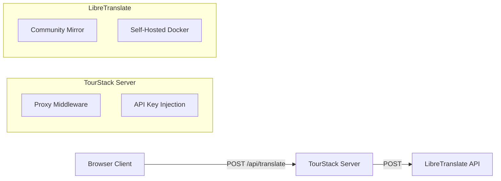

# TourStack Translation Infrastructure

**Status**: ✅ Implemented (v1.0)
**Last Updated**: January 20, 2026

## Overview

TourStack implements a robust, two-tiered translation system designed for museums:

1.  **UI Translation (i18next)**: Static interface elements (buttons, menus)
2.  **Content Translation ("Magic Translate")**: Dynamic museum content using **LibreTranslate**

---

## 1. UI Translation (i18n)

The application uses `i18next` for interface localization.

-   **Config**: `src/i18n/i18n.ts`
-   **Locales**: `src/i18n/locales/*.json` (e.g., `en.json`, `es.json`)
-   **Usage**:
    ```typescript
    const { t } = useTranslation();
    <h1>{t('stopEditor.title')}</h1>
    ```

To add a new language for the UI:
1.  Create `src/i18n/locales/[lang].json`
2.  Import and add to resources in `src/i18n/i18n.ts`

---

## 2. Content Translation ("Magic Translate")

Content translation is handled by a specialized service that integrates with **LibreTranslate**.

-   **Service**: `src/services/translationService.ts`
-   **Server Proxy**: `server/routes/translate.ts` (Handles CORS & API keys)
-   **Component**: `MagicTranslateButton.tsx`

### Architecture



### Configuration

The translation service is configured via environment variables in the server.

| Variable | Description | Default |
|----------|-------------|---------|
| `LIBRE_TRANSLATE_URL` | URL of the LibreTranslate instance | `https://translate.supersoul.top/translate` |
| `LIBRE_TRANSLATE_API_KEY` | API Key (if required by instance) | `TranslateThisForMe26` |

### Local Development (Important)

In local development, the app runs as **two processes**:

- **Vite dev server**: `http://localhost:5173`
- **Express API server**: `http://localhost:3000`

Vite proxies requests so the browser can call `/api/*` without CORS issues:

- `/api/*` -> `http://localhost:3000/api/*`
- `/uploads/*` -> `http://localhost:3000/uploads/*`

Recommended command:

```bash
cd app
npm run dev:all
```

If you only run `npm run dev` (Vite) and not the API server, you will see errors like:

- `Cannot POST /api/translate/extract`
- `Failed to load resource: the server responded with a status of 404`

### Self-Hosting LibreTranslate: Loaded Languages (LT_LOAD_ONLY)

LibreTranslate can be configured to load only a subset of language models via `LT_LOAD_ONLY`.

If a tour enables a language that LibreTranslate did not load, "Magic Translate" may fail and the UI may fall back to English.

Example configuration used in production:

```bash
LT_LOAD_ONLY=en,es,fr,de,ja,it,ko,zh,pt
```

Note: more languages/models increases memory usage.

### Quick Verification (Curl)

You can test a LibreTranslate instance directly:

```bash
curl -X POST https://translate.supersoul.top/translate \
  -H "Content-Type: application/json" \
  -d '{"q":"Hello world","source":"en","target":"zh","api_key":"TranslateThisForMe26"}'
```

### Self-Hosting LibreTranslate

For production use, we recommend self-hosting LibreTranslate to avoid rate limits and costs.

**Docker Command:**
```bash
docker run -d \
  -p 5000:5000 \
  --restart unless-stopped \
  libretranslate/libretranslate
```

**Coolify Deployment:**
1.  Add Service -> Docker Image -> `libretranslate/libretranslate`
2.  Expose port 5000
3.  Set environment in TourStack:
    -   `LIBRE_TRANSLATE_URL=http://<container-name>:5000/translate`

---

## 3. Importing Text From Files (Text Block)

Text blocks support importing content from documents using the server-side translation proxy.

- **UI**: Text block editor -> **Import File** button
- **Server endpoints**:
    - `POST /api/translate/extract` (extract text)
    - `POST /api/translate/file` (translate a document)

Supported formats:

- `.txt`
- `.odt`
- `.odp`
- `.docx`
- `.pptx`
- `.epub`
- `.html`
- `.srt`
- `.pdf`

Notes:

- Some PDFs exported from macOS apps may not contain extractable text (e.g. image-based PDFs). If import fails, test with a `.txt` file first.

---

## 4. Usage Guide

### Enabling Languages for a Tour
1.  Go to Tour Settings (or set via API)
2.  Update `languages` array: `['en', 'es', 'fr']`

### Editing & Translating Content
1.  Open **Stop Editor**
2.  Available languages appear as tabs (e.g., `EN`, `ES`, `FR`)
3.  **To Translate**:
    -   Write content in the primary language (e.g., English)
    -   Click **✨ Translate to All**
    -   Review generated translations in other tabs
4.  **Preview**:
    -   Click "Preview" icon
    -   Use language pill toggle in modal header to verify visitor experience


---

## 5. Troubleshooting

**"Translation Failed" Error:**
-   Check browser console network tab for `/api/translate` response.
-   If `500` error: Server cannot reach LibreTranslate. Check `LIBRE_TRANSLATE_URL`.
-   If `400` error: Invalid API key or unsupported language pair.
-   **Mock Mode**: If `LIBRE_TRANSLATE_URL=mock`, server returns bracketed text (e.g. `[ES] Hello`) for verification.

**`Cannot POST /api/translate/extract` / 404 on `/api/translate/*`:**
- Ensure the API server is running on `http://localhost:3000`.
- Recommended: `npm run dev:all`.

**File Import JSON parse error (`Unexpected token '<' ... is not valid JSON`):**
- This usually means the client received an HTML error page instead of JSON.
- Check that the API server is running and the Vite proxy is pointing to port `3000`.

**CORS Errors:**
-   Ensure client calls `/api/translate` (our proxy), NOT external URLs directly.
