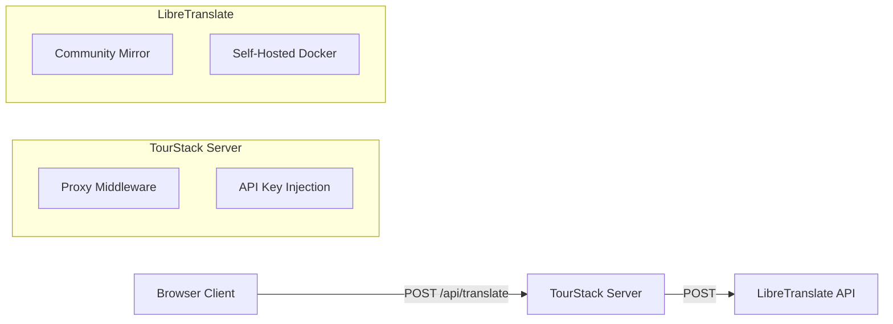
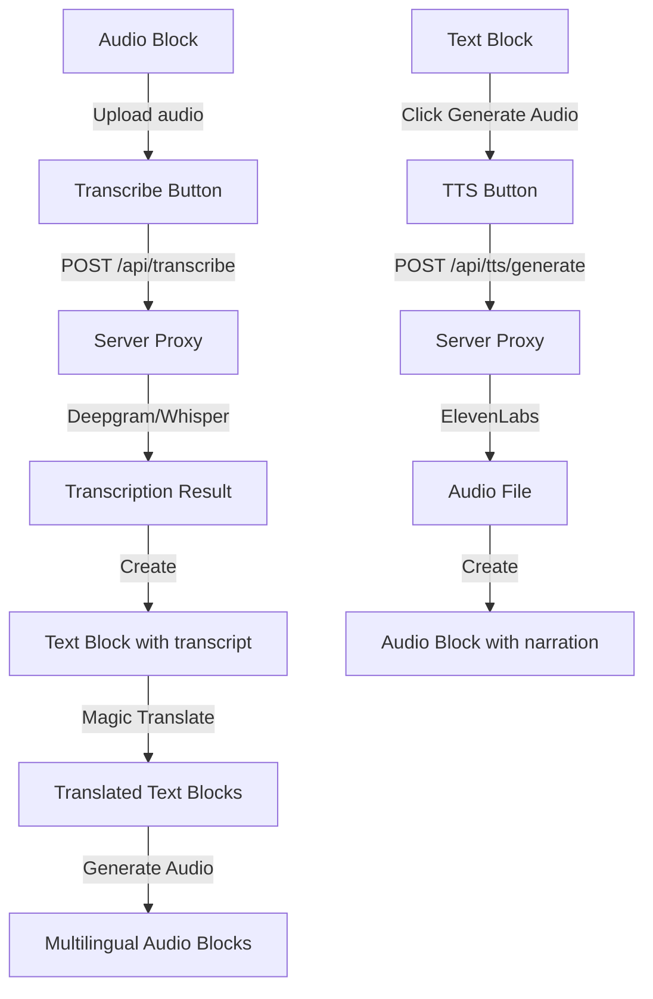

# TourStack Translation Infrastructure

**Status**: ✅ Implemented (v1.0)
**Last Updated**: January 20, 2026

## Overview

TourStack implements a robust, two-tiered translation system designed for museums:

1.  **UI Translation (i18next)**: Static interface elements (buttons, menus)
2.  **Content Translation ("Magic Translate")**: Dynamic museum content using **LibreTranslate**

---

## 1. UI Translation (i18n)

The application uses `i18next` for interface localization.

-   **Config**: `src/i18n/i18n.ts`
-   **Locales**: `src/i18n/locales/*.json` (e.g., `en.json`, `es.json`)
-   **Usage**:
    ```typescript
    const { t } = useTranslation();
    <h1>{t('stopEditor.title')}</h1>
    ```

To add a new language for the UI:
1.  Create `src/i18n/locales/[lang].json`
2.  Import and add to resources in `src/i18n/i18n.ts`

---

## 2. Content Translation ("Magic Translate")

Content translation is handled by a specialized service that integrates with **LibreTranslate**.

-   **Service**: `src/services/translationService.ts`
-   **Server Proxy**: `server/routes/translate.ts` (Handles CORS & API keys)
-   **Component**: `MagicTranslateButton.tsx`

### Architecture



### Configuration

The translation service is configured via environment variables in the server.

| Variable | Description | Default |
|----------|-------------|---------|
| `LIBRE_TRANSLATE_URL` | URL of the LibreTranslate instance | `https://translate.supersoul.top/translate` |
| `LIBRE_TRANSLATE_API_KEY` | API Key (if required by instance) | `TranslateThisForMe26` |

### Local Development (Important)

> [!CAUTION]
> **ALWAYS use `npm run dev:all`** to start development!  
> The app requires BOTH the Vite frontend AND the Express API server.

In local development, the app runs as **two processes**:

- **Vite dev server**: `http://localhost:5173`
- **Express API server**: `http://localhost:3000`

Vite proxies requests so the browser can call `/api/*` without CORS issues:

- `/api/*` -> `http://localhost:3000/api/*`
- `/uploads/*` -> `http://localhost:3000/uploads/*`

**Required command:**

```bash
cd app
npm run dev:all       # ⭐ REQUIRED: Starts BOTH servers
```

> [!WARNING]
> If you only run `npm run dev` (Vite) and not the API server, you will see errors like:
> - `Cannot POST /api/translate/extract`
> - `Cannot POST /api/transcribe`
> - `Failed to load resource: the server responded with a status of 404`

### Self-Hosting LibreTranslate: Loaded Languages (LT_LOAD_ONLY)

LibreTranslate can be configured to load only a subset of language models via `LT_LOAD_ONLY`.

If a tour enables a language that LibreTranslate did not load, "Magic Translate" may fail and the UI may fall back to English.

Example configuration used in production:

```bash
LT_LOAD_ONLY=en,es,fr,de,ja,it,ko,zh,pt
```

Note: more languages/models increases memory usage.

### Quick Verification (Curl)

You can test a LibreTranslate instance directly:

```bash
curl -X POST https://translate.supersoul.top/translate \
  -H "Content-Type: application/json" \
  -d '{"q":"Hello world","source":"en","target":"zh","api_key":"TranslateThisForMe26"}'
```

### Self-Hosting LibreTranslate

For production use, we recommend self-hosting LibreTranslate to avoid rate limits and costs.

**Docker Command:**
```bash
docker run -d \
  -p 5000:5000 \
  --restart unless-stopped \
  libretranslate/libretranslate
```

**Coolify Deployment:**
1.  Add Service -> Docker Image -> `libretranslate/libretranslate`
2.  Expose port 5000
3.  Set environment in TourStack:
    -   `LIBRE_TRANSLATE_URL=http://<container-name>:5000/translate`

---

## 3. Importing Text From Files (Text Block)

Text blocks support importing content from documents using the server-side translation proxy.

- **UI**: Text block editor -> **Import File** button
- **Server endpoints**:
    - `POST /api/translate/extract` (extract text)
    - `POST /api/translate/file` (translate a document)

Supported formats:

- `.txt`
- `.odt`
- `.odp`
- `.docx`
- `.pptx`
- `.epub`
- `.html`
- `.srt`
- `.pdf`

Notes:

- Some PDFs exported from macOS apps may not contain extractable text (e.g. image-based PDFs). If import fails, test with a `.txt` file first.

---

## 4. Usage Guide

### Enabling Languages for a Tour
1.  Go to Tour Settings (or set via API)
2.  Update `languages` array: `['en', 'es', 'fr']`

### Editing & Translating Content
1.  Open **Stop Editor**
2.  Available languages appear as tabs (e.g., `EN`, `ES`, `FR`)
3.  **To Translate**:
    -   Write content in the primary language (e.g., English)
    -   Click **✨ Translate to All**
    -   A confirmation modal appears showing the number of languages being translated
    -   Review generated translations in other tabs
4.  **Save Your Work**:
    -   Click **Save** to see a new confirmation dialog
    -   Choose **Save & Continue Editing** to keep working
    -   Or select **Save & Exit** to return to the stop list
    -   Remember to save after translating for changes to appear in preview
5.  **Preview**:
    -   Click "Preview" icon
    -   Use language pill toggle in modal header to verify visitor experience


---

## 5. Troubleshooting

**"Translation Failed" Error:**
-   Check browser console network tab for `/api/translate` response.
-   If `500` error: Server cannot reach LibreTranslate. Check `LIBRE_TRANSLATE_URL`.
-   If `400` error: Invalid API key or unsupported language pair.
-   **Mock Mode**: If `LIBRE_TRANSLATE_URL=mock`, server returns bracketed text (e.g. `[ES] Hello`) for verification.

**`Cannot POST /api/translate/extract` / 404 on `/api/translate/*`:**
- Ensure the API server is running on `http://localhost:3000`.
- Recommended: `npm run dev:all`.

**File Import JSON parse error (`Unexpected token '<' ... is not valid JSON`):**
- This usually means the client received an HTML error page instead of JSON.
- Check that the API server is running and the Vite proxy is pointing to port `3000`.

**CORS Errors:**
-   Ensure client calls `/api/translate` (our proxy), NOT external URLs directly.

---

## 6. AI Services Integration Groundplan

TourStack is building toward a unified AI services architecture supporting **Speech-to-Text (STT)**, **Text-to-Speech (TTS)**, **Translation**, and future AI capabilities.

### Terminology Reference

| Term | Also Known As | Description |
|------|---------------|-------------|
| **Speech-to-Text (STT)** | ASR, Transcription, Voice Recognition | Converts spoken audio into written text |
| **Text-to-Speech (TTS)** | Voice Synthesis, Audio Generation | Converts written text into spoken audio |
| **Translation** | Machine Translation, MT | Converts text from one language to another |

### Current Services

| Service | Type | Status | Configuration |
|---------|------|--------|---------------|
| **LibreTranslate** | Translation | ✅ Implemented | Settings → Translation tab |
| **Deepgram** | STT (ASR) | ✅ Implemented | Settings → Transcription tab |
| **Whisper** | STT (ASR) | 🚧 UI Ready | Settings → Transcription tab |
| **ElevenLabs** | TTS | 🚧 UI Ready | Settings → Transcription tab |

### Architecture: Provider Abstraction Pattern

To support multiple services for the same capability, TourStack uses a **Provider Pattern**:

```typescript
// Example: Transcription Provider Interface
interface TranscriptionProvider {
  name: string;
  transcribe(audio: Blob, options?: TranscriptionOptions): Promise<TranscriptionResult>;
  isConfigured(): boolean;
}

// Implementations
class DeepgramProvider implements TranscriptionProvider { ... }
class WhisperProvider implements TranscriptionProvider { ... }

// Factory
function getTranscriptionProvider(name: 'deepgram' | 'whisper'): TranscriptionProvider;
```

### Phase 1: Deepgram Integration (STT)

**Goal**: Enable audio blocks to transcribe spoken content into text.

**Implementation Steps**:

1. **Server Proxy Route** (`server/routes/transcribe.ts`)
   - `POST /api/transcribe` - Proxy to Deepgram API
   - Inject API key server-side (never expose to client)
   - Handle audio file uploads (multipart/form-data)

2. **Transcription Service** (`src/services/transcriptionService.ts`)
   ```typescript
   export async function transcribeAudio(
     audioBlob: Blob, 
     options?: { language?: string; model?: string }
   ): Promise<{ text: string; confidence: number; words?: Word[] }>;
   ```

3. **Audio Block Integration**
   - Add "Transcribe" button to Audio blocks
   - Auto-populate Text block with transcription
   - Support word-level timestamps for sync

4. **Environment Variables**:
   ```bash
   DEEPGRAM_API_KEY=your_api_key_here
   DEEPGRAM_MODEL=nova-2  # or whisper, enhanced, etc.
   ```

### Phase 2: Whisper Integration (Self-hosted STT)

**Goal**: Provide offline/self-hosted transcription option.

**Implementation**:
- Same `TranscriptionProvider` interface
- Configurable endpoint URL (whisper.cpp server, faster-whisper, etc.)
- Useful for: air-gapped deployments, cost reduction, privacy

**Docker Deployment**:
```bash
docker run -d -p 8080:8080 onerahmet/openai-whisper-asr-webservice
```

### Phase 3: ElevenLabs Integration (TTS)

**Goal**: Generate audio narration from text content.

**Use Cases**:
- Auto-generate audio guides from Text blocks
- Create multilingual audio from translated content
- Voice cloning for consistent narrator

**Implementation Steps**:

1. **Server Proxy Route** (`server/routes/tts.ts`)
   - `POST /api/tts/generate` - Generate speech from text
   - `GET /api/tts/voices` - List available voices

2. **TTS Service** (`src/services/ttsService.ts`)
   ```typescript
   export async function generateSpeech(
     text: string,
     options?: { voice?: string; language?: string }
   ): Promise<Blob>;
   ```

3. **Text Block Integration**
   - Add "Generate Audio" button to Text blocks
   - Creates linked Audio block with generated speech

### Phase 4: Future Services

| Service | Type | Potential Use |
|---------|------|---------------|
| **OpenAI Whisper API** | STT | Cloud-based alternative |
| **Google Cloud STT** | STT | Enterprise accuracy |
| **Amazon Polly** | TTS | AWS ecosystem |
| **Azure Cognitive** | STT/TTS | Microsoft ecosystem |
| **Coqui TTS** | TTS | Self-hosted open-source |

### Settings Storage

API keys and configuration are stored:
- **Development**: Environment variables (`.env`)
- **Production**: Database `AppSettings` table (encrypted)
- **UI**: Settings page (Transcription & Translation tabs)

### Security Considerations

1. **Never expose API keys to client** - All external API calls go through server proxy
2. **Encrypt stored keys** - Use encryption at rest for database-stored keys
3. **Rate limiting** - Implement per-user/per-tour rate limits
4. **Audit logging** - Track API usage for billing and abuse detection

### Block Integration Workflow



### Development Checklist

- [x] Settings UI for Transcription services (Deepgram, Whisper, ElevenLabs)
- [x] Settings UI for Translation services (LibreTranslate)
- [x] Server proxy route for Deepgram (`/api/transcribe`) ✅ Jan 21, 2026
- [x] `transcriptionService.ts` with provider pattern ✅ Jan 21, 2026
- [x] Audio block "Transcribe with AI" button ✅ Jan 21, 2026
- [x] Timeline Gallery "Transcribe" button ✅ Jan 21, 2026
- [x] Closed Captions component with word-level timestamps ✅ Jan 21, 2026
- [x] CC toggle in Timeline Gallery Editor and Preview ✅ Jan 21, 2026
- [ ] Server proxy route for TTS (`/api/tts`)
- [ ] `ttsService.ts` with provider pattern  
- [ ] Text block "Generate Audio" button
- [ ] Settings persistence to database
- [ ] Integration tests for each provider
